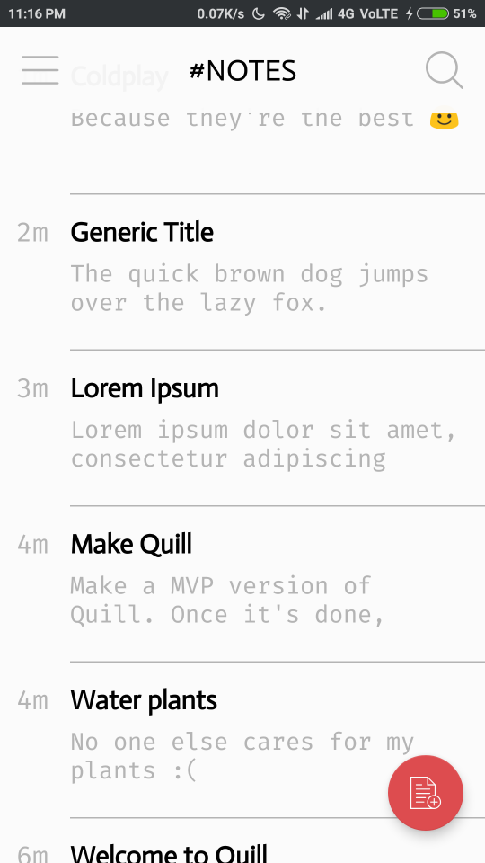
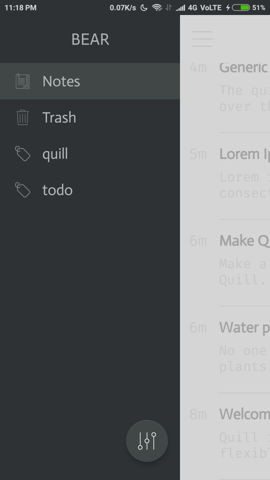
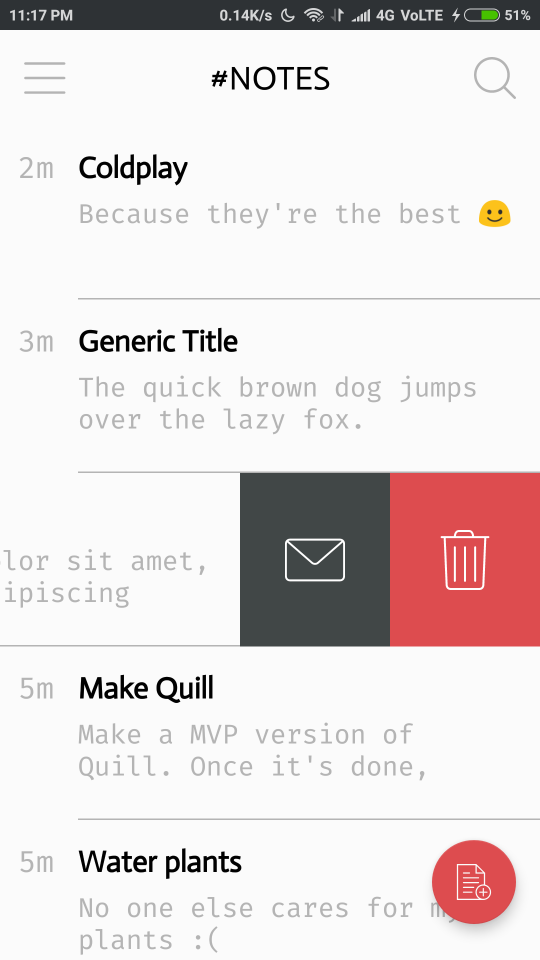
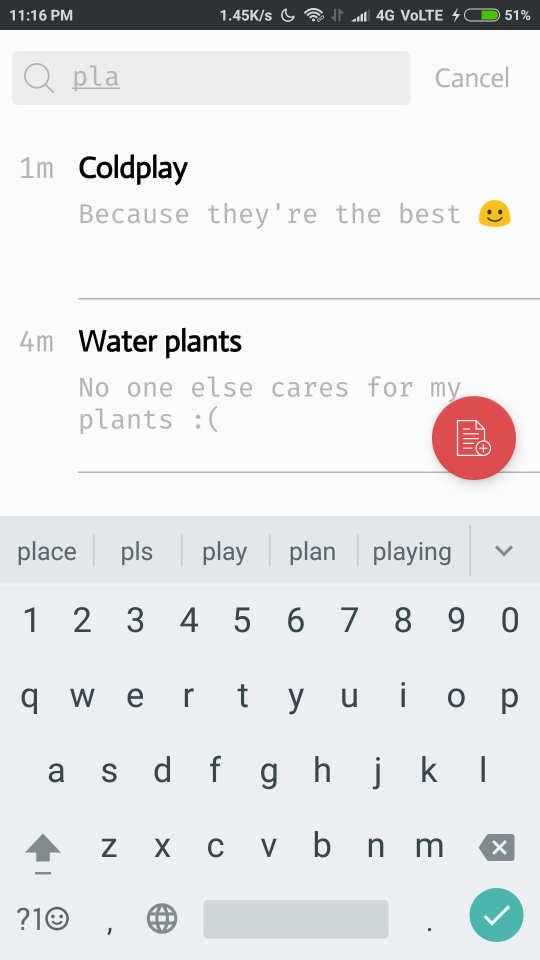
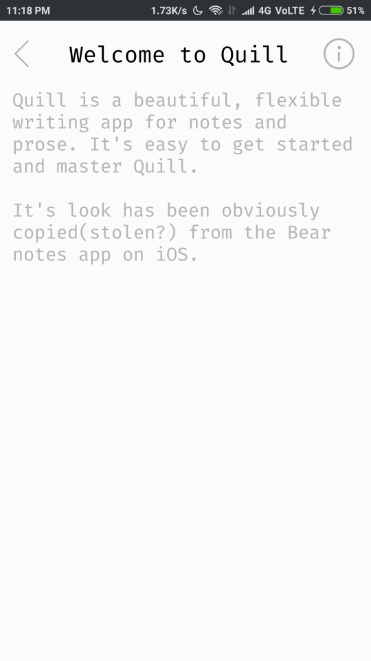
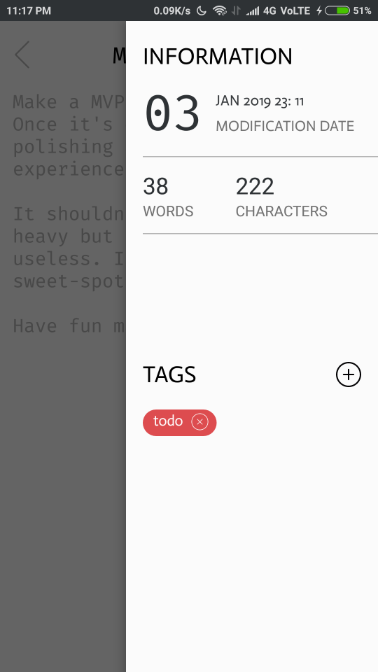
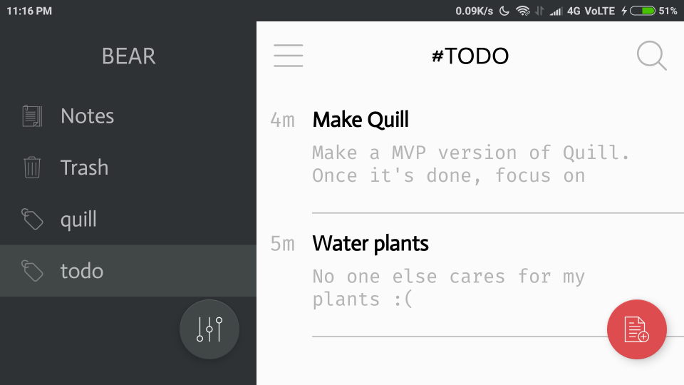

# Quill
This is an Android notes app whose design is inspired by the Bear Notes app on iOS. Why should only iOS have all the eye-candy? :D

## Functionality
Though Quill borrows most of it's design from Bear, it support's only a subset of it's functionality. Quill supports searching and tagging notes. It also displays some statistics about the notes.

## Screenshots
Since the design is the best(read: only good) thing about this app, here are the screenshots. Open in new tab to see full size images.
 
<a href="https://raw.githubusercontent.com/AnEnigmaticBug/Quill/master/screenshots/s0.png"></img></a>
<a href="https://raw.githubusercontent.com/AnEnigmaticBug/Quill/master/screenshots/s1.png"></img></a>
 
<a href="https://raw.githubusercontent.com/AnEnigmaticBug/Quill/master/screenshots/s2.png"></img></a>
<a href="https://raw.githubusercontent.com/AnEnigmaticBug/Quill/master/screenshots/s3.png"></img></a>
 
<a href="https://raw.githubusercontent.com/AnEnigmaticBug/Quill/master/screenshots/s4.png"></img></a>
<a href="https://raw.githubusercontent.com/AnEnigmaticBug/Quill/master/screenshots/s5.png"></img></a>
 
<a href="https://raw.githubusercontent.com/AnEnigmaticBug/Quill/master/screenshots/s6.png"></img></a>

## Planned features
I'm planning on adding the ability to sync notes online(most probably using Firebase). Also, adding basic text formatting options is something I would really like on having.

## Credits
I've said it before and I'll say it again that the entire design has been inspired(copied?) from the [Bear](https://bear.app)  notes app on iOS. Nearly all the icons have been obtained from [flaticon](https://www.flaticon.com/)
